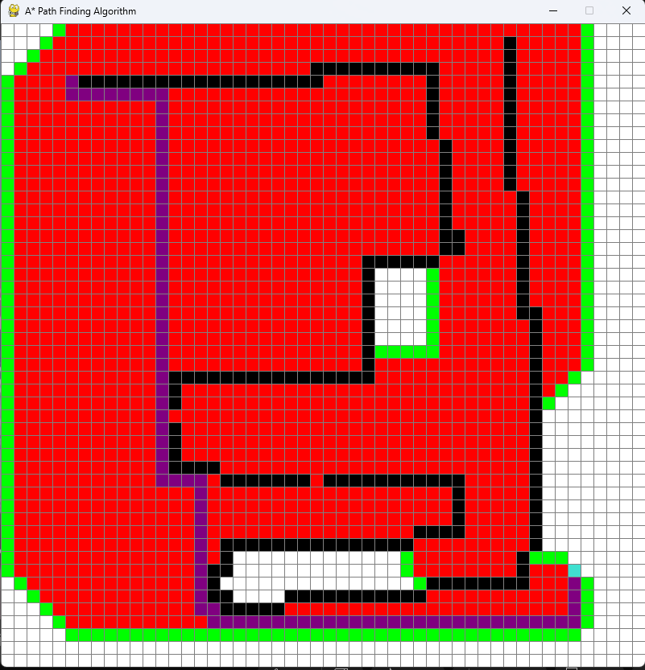

# A* Pathfinding Algorithm with Pygame Visualization
## ui

This project implements the A* pathfinding algorithm in Python, designed to find the optimal path between two points on a grid. The grid visualization is rendered using Pygame, allowing users to see how the algorithm navigates through barriers, from the start to the destination, and finally highlights the shortest path.

## Features
- **A* Algorithm**: Efficiently finds the shortest path between two points.
- **Real-time Visualization**: Pygame is used to visualize the algorithm's process.
- **Grid Representation**: The grid consists of:
  - **Black cells** representing barriers (impassable areas).
  - **Orange cell** for the start point.
  - **Blue cell** for the destination point.
  - **Purple cells** representing the shortest path found by the algorithm.

## Requirements
- Python 3.x
- Pygame 2.0.0 or higher

### Installation
1. Clone the repository:

   ```bash
   git clone https://github.com/yourusername/a-star-pathfinding.git
   cd a-star-pathfinding
   python astar.py
